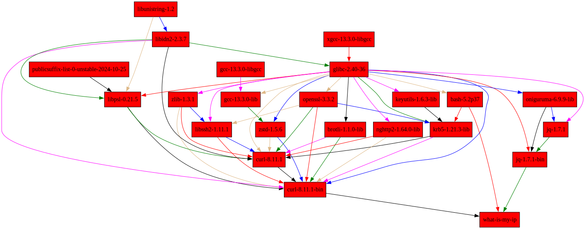

---
# You can also start simply with 'default'
theme: default

background: ./images/nix-wallpaper-nineish-catppuccin-latte-alt.svg
# some information about your slides (markdown enabled)
title: Learn Nix the Fun Way
info: |
  ## Slidev Starter Template
  Presentation slides for developers.

  Learn more at [Sli.dev](https://sli.dev)
# apply unocss classes to the current slide
class: text-center
# https://sli.dev/features/drawing
drawings:
  persist: false
# slide transition: https://sli.dev/guide/animations.html#slide-transitions
transition: slide-left
# enable MDC Syntax: https://sli.dev/features/mdc
mdc: true
---

# Learn Nix the Fun Way

PlanetNix (SCaLE 22x), Pasadena, CA 2025

Farid Zakaria <farid.m.zakaria@gmail.com>

---
transition: fade-out
layout: two-cols
---

# Hello 👋

My name is Farid Zakaria, and I'm a software engineer at [Confluent](https://www.confluent.io/) mostly working on Bazel and pursuing a nearly-complete PhD at UC Santa Cruz.

- "Long-time" Nix user (circa 2025)
- Introduced Nix at [Looker](https://cloud.google.com/looker) (purchased by Google) and active member of internal community
- Migrated a substantial JRuby, Java, Kotlin & JavaScript codebase to Nix; mostly via `nix-shell`
- Daily drive NixOS on my wonderful [frame.work](https://frame.work) laptop
- Leverage Nix for a lot of my PhD work (come find me to talk about ongoing reasearch)

::right::

<div style="margin-top: -40px">
  

  <div style="margin-top:-50px; text-align: center;">

[farid.m.zakaria@gmail.com](mailto:farid.m.zakaria@gmail.com)

[linkedin.com/in/fmzakari/](https://www.linkedin.com/in/fmzakari/)

[x.com/fmzakari](https://x.com/fmzakari)

  </div>
</div>

<style>
h1 {
  background-color: #2B90B6;
  background-image: linear-gradient(45deg,rgb(158, 212, 78) 10%,rgb(140, 118, 20) 20%);
  background-size: 100%;
  -webkit-background-clip: text;
  -moz-background-clip: text;
  -webkit-text-fill-color: transparent;
  -moz-text-fill-color: transparent;
}

img {
  margin-left: 3em;
  width: 300px;
  height: auto;
  clip-path: circle();

}
</style>

<!--
Here is another comment.
-->

---
layout: statement
---

Why I love Nix, and you should too! 💖

<style>
p {
  font-size: 2em;
}
</style>

---
layout: center
transition: fade
---

<div>
  
  >
</div>

---
layout: center
transition: slide-left
---

<div>
  


</div>

---
layout: statement
---

Let’s do it different this time.

<span v-click v-mark.underline.green>_Let’s learn Nix the fun way._</span>

<style>
p {
  font-size: 2em;
  line-height: 2em; 
}
</style>

---
layout: center
transition: slide-up
---

# What is my IP ?

<div style="--slidev-code-font-size: 30px; --slidev-code-line-height: 50px;">

````md magic-move
```bash {all}
#! /usr/bin/env bash
> curl -s http://httpbin.org/get | \
    jq --raw-output .origin
```

```bash {all}
#! /usr/bin/env bash
> curl -s http://httpbin.org/get | \
    jq --raw-output .origin
73.231.52.39
```
````

</div>

---
layout: center
---

````md magic-move
```nix {all}
{
  system ? builtins.currentSystem,
  pkgs ?
    # NixOS24.11
    import (fetchTarball "https://github.com/NixOS/nixpkgs/archive/5ef6c425980847c78a80d759abc476e941a9bf42.tar.gz") {
      inherit system;
    },
}:
derivation {
  name = "what-is-my-ip";
  builder = "/bin/sh";
  args = [
    "-c"
    ''
      ${pkgs.coreutils}/bin/mkdir -p $out/bin
      echo '#!/bin/sh' > $out/bin/what-is-my-ip
      echo '${pkgs.curl}/bin/curl -s http://httpbin.org/get | \
      ${pkgs.jq}/bin/jq --raw-output .origin' \
            >> $out/bin/what-is-my-ip
      ${pkgs.coreutils}/bin/chmod +x $out/bin/what-is-my-ip
    ''
  ];
  system = builtins.currentSystem;
  outputs = ["out"];
}
```

```nix {all|4|all}
{
  system ? builtins.currentSystem,
  pkgs ?
    import (fetchTarball "https://github.com/NixOS/nixpkgs/archive/5ef6c425980847c78a80d759abc476e941a9bf42.tar.gz") {
      inherit system;
    },
}:
pkgs.writeShellScriptBin "what-is-my-ip" ''
  ${pkgs.curl}/bin/curl -s http://httpbin.org/get | \
    ${pkgs.jq}/bin/jq --raw-output .origin
''
```
````

---
layout: center
---

<div style="--slidev-code-font-size: 20px; --slidev-code-line-height: 1.5em; max-width:100%">

````md magic-move
```shell {all}
> nix build -f what-is-my-ip.nix --print-out-paths
```

```shell {2}
> nix build -f what-is-my-ip.nix --print-out-paths
/nix/store/y2g0ijqqiyi9vxr9xgmvvgblxqflqzav-what-is-my-ip
```

```shell
> /nix/store/y2g0ijqqiyi9vxr9xgmvvgblxqflqzav-what-is-my-ip/bin/what-is-my-ip
```

```shell
> /nix/store/y2g0ijqqiyi9vxr9xgmvvgblxqflqzav-what-is-my-ip/bin/what-is-my-ip
73.231.52.39
```
````

</div>

---
layout: center
---

<div style="--slidev-code-font-size: 0.8em; --slidev-code-line-height: 1.5em;">

````md magic-move
```console
> cat /nix/store/y2g0ijqqiyi9vxr9xgmvvgblxqflqzav-what-is-my-ip/bin/what-is-my-ip
```

```console
> cat /nix/store/y2g0ijqqiyi9vxr9xgmvvgblxqflqzav-what-is-my-ip/bin/what-is-my-ip
#!/nix/store/gwgqdl0242ymlikq9s9s62gkp5cvyal3-bash-5.2p37/bin/bash
/nix/store/7p8814g62bybwa8blmaqr9piv3vjwan5-curl-8.11.1-bin/bin/curl -s http://httpbin.org/get | \
/nix/store/jhw7aklgrc23125ysg1mc72y8zq0lndw-jq-1.7.1-bin/bin/jq --raw-output .origin
```
````

</div>

---
layout: center
---

````md magic-move
```nix
let
  pkgs = import (fetchTarball "https://github.com/NixOS/nixpkgs/archive/5ef6c425980847c78a80d759abc476e941a9bf42.tar.gz") {};
  what-is-my-ip = import ./what-is-my-ip.nix {inherit pkgs;};
in
  pkgs.mkShell {
    packages = [what-is-my-ip];

    shellHook = ''
      echo "Hello, PlanetNix!"
    '';
  }
```

```console
> nix-shell what-is-my-ip-shell.nix
```

```console
> nix-shell what-is-my-ip-shell.nix
Hello, PlanetNix!
```

```console
> nix-shell what-is-my-ip-shell.nix
Hello, PlanetNix!

[nix-shell]
> which what-is-my-ip
```

```console
> nix-shell what-is-my-ip-shell.nix
Hello, PlanetNix!

[nix-shell]
> which what-is-my-ip
/nix/store/y2g0ijqqiyi9vxr9xgmvvgblxqflqzav-what-is-my-ip/bin/what-is-my-ip
```

```console
> nix-shell what-is-my-ip-shell.nix
Hello, PlanetNix!

[nix-shell]
> which what-is-my-ip
/nix/store/y2g0ijqqiyi9vxr9xgmvvgblxqflqzav-what-is-my-ip/bin/what-is-my-ip

[nix-shell]
> /nix/store/y2g0ijqqiyi9vxr9xgmvvgblxqflqzav-what-is-my-ip/bin/what-is-my-ip
73.231.52.39
```
````

Remember <u>y2g0ijqqiyi9vxr9xgmvvgblxqflqzav</u>

---
layout: center
---

<h3>Reproducible Developer Environments ✔️</h3>
<p>
  
</p>

---
layout: center
---

<v-clicks>
We actually know everything about our code know.

We can now do binary or source deployments 🚀🛠️📦 since we know the full dependency closure of our tool(s).
</v-clicks>

<span v-click>We <u>simply copy</u> the necessary <code>/nix/store</code> paths to another machine </span><s v-click>with Nix installed.</s>

<span v-click>Profit 🤑</span>

---
layout: center
---

````md magic-move
```console
> nix copy --to ssh://dennard.soe.ucsc.edu \
  $(nix build -f what-is-my-ip.nix --print-out-paths)
```

```console
> nix copy --to ssh://dennard.soe.ucsc.edu \
  $(nix build -f what-is-my-ip.nix --print-out-paths)

> ssh dennard.soe.ucsc.edu
Last login: Mon Mar  3 05:02:57 2025 from 73.231.52.39
```

```console
> nix copy --to ssh://dennard.soe.ucsc.edu \
  $(nix build -f what-is-my-ip.nix --print-out-paths)

> ssh dennard.soe.ucsc.edu
Last login: Mon Mar  3 05:02:57 2025 from 73.231.52.39

[dennard]
> /nix/store/y2g0ijqqiyi9vxr9xgmvvgblxqflqzav-what-is-my-ip/bin/what-is-my-ip
128.114.53.24
```
````

Remember <u>y2g0ijqqiyi9vxr9xgmvvgblxqflqzav</u>

---
layout: center
---

<h3>Binary (or source) Deployments ✔️</h3>
<p>
  
</p>

---
layout: center
---

<p>
Once you know your full software graph, everything is a permutation on that.
</p>


